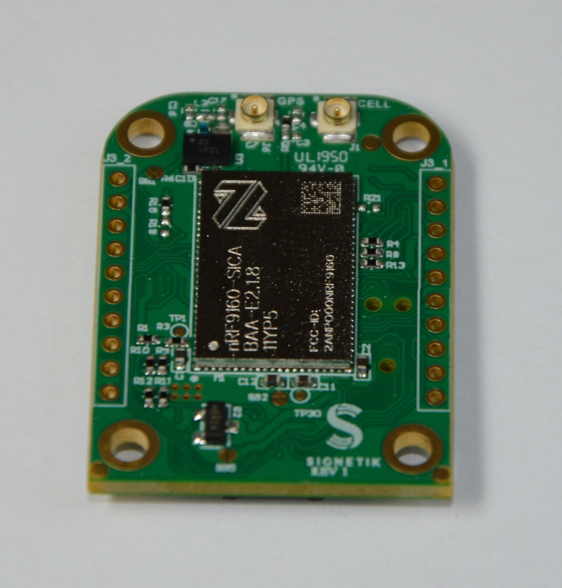

.. _Signetik_SigCell:

Signetik-SigCell
################

Overview
********

Signetik's SigCell is a cellular system utilizing the nRF9160,
supporting LTE-M and NB-IoT. The signetik_sigcellns board
provides support for the for the Nordic Semiconductor nRF9160 
ARM Cortex-M33F CPU with ARMv8-M Security Extension and the
following:

* SigLight light sensor add-on
* SigAccel accelerometer add-oon.
* On-board LEDs
* Power enabling (external)
* Debug UART
* LTE-M / NB-IoT Modem support

     Signetik SigCell main board (Credit: Signetik)

More information about the board can be found from info@signetik.com

Security components
===================

- Implementation Defined Attribution Unit (`IDAU`_).  The IDAU is implemented
  with the System Protection Unit and is used to define secure and non-secure
  memory maps.  By default, all of the memory space  (Flash, SRAM, and
  peripheral address space) is defined to be secure accessible only.
- Secure boot.

Programming and Debugging
*************************

signetik_sigcellns supports the Armv8m Security Extension, and by default boots
in the Secure state.

Building Secure/Non-Secure Zephyr applications
==============================================

The process requires the following steps:

1. Build the Secure Zephyr application using ``-DBOARD=signetik_sigcell`` and
   ``CONFIG_TRUSTED_EXECUTION_SECURE=y`` in the the application project configuration file.
2. Build the Non-Secure Zephyr application using ``-DBOARD=signetik_sigcellns``.
3. Merge the two binaries together.

When building a Secure/Non-Secure application, the Secure application will
have to set the IDAU (SPU) configuration to allow Non-Secure access to all
CPU resources utilized by the Non-Secure application firmware. SPU
configuration shall take place before jumping to the Non-Secure application.

Building a Secure only application
==================================

Build the Zephyr app in the usual way (see :ref:`build_an_application`
and :ref:`application_run`), using ``-DBOARD=signetik_sigcell``.

Flashing
========

Follow the instructions in the :ref:`nordic_segger` page to install
and configure all the necessary software. Further information can be
found in :ref:`nordic_segger_flashing`. Then build and flash
applications as usual (see :ref:`build_an_application` and
:ref:`application_run` for more details).

Here is an example for the :ref:`hello_world` application.

First, run your favorite terminal program to listen for output.

.. code-block:: console

   $ minicom -D <tty_device> -b 115200

Replace :code:`<tty_device>` with the port where the board Signetik SigCell
can be found. For example, under Linux, :code:`/dev/ttyACM0`.

Then build and flash the application in the usual way.

.. zephyr-app-commands::
   :zephyr-app: samples/hello_world
   :board: signetik_sigcell
   :goals: build flash

Debugging
=========

Refer to the :ref:`nordic_segger` page to learn about debugging Nordic boards with a
Segger IC.

Testing the LEDs and buttons in the nRF9160 DK
**********************************************

There are 2 samples that allow you to test that the buttons (switches) and LEDs on
the board are working properly with Zephyr:

* :ref:`blinky-sample`
* :ref:`button-sample`

You can build and flash the examples to make sure Zephyr is running correctly on
your board. The LED definitions can be found in
:zephyr_file:`boards/arm/signetik/signetik_sigcell_common.dts`.

References
**********

.. target-notes::

.. _IDAU:
   https://developer.arm.com/products/architecture/cpu-architecture/m-profile/docs/100690/latest/attribution-units-sau-and-idau
.. _Nordic Semiconductor Documentation library: https://www.nordicsemi.com/DocLib
